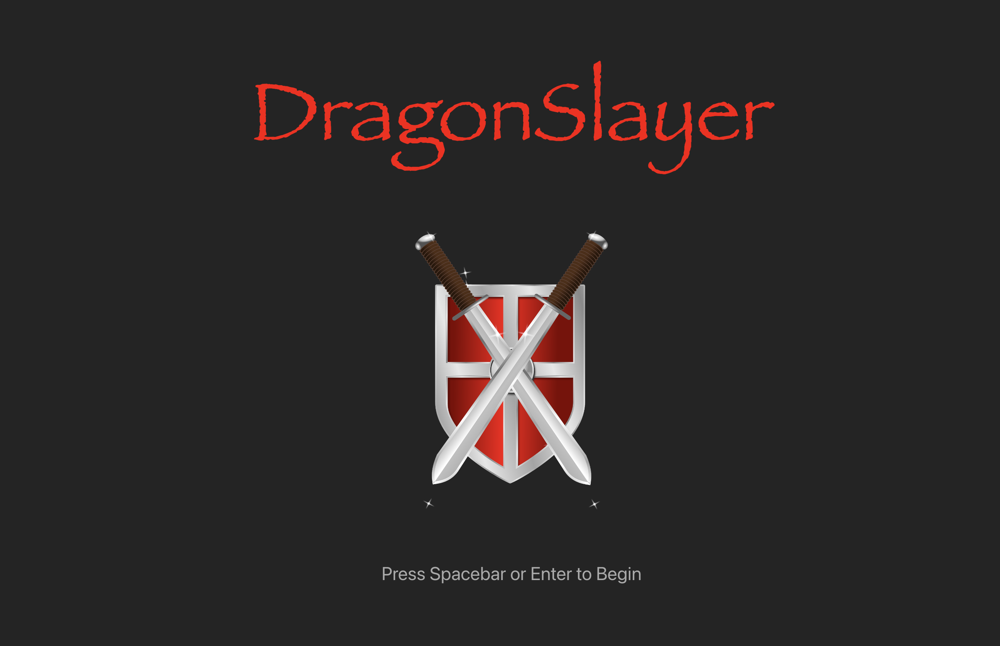
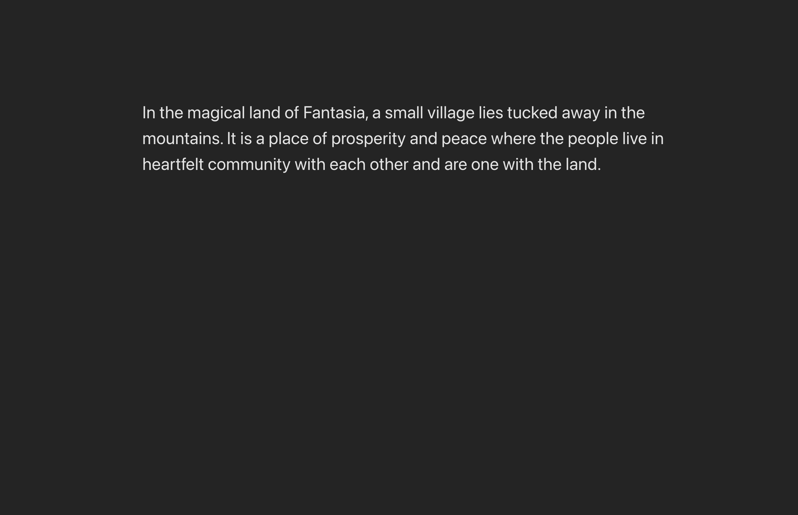
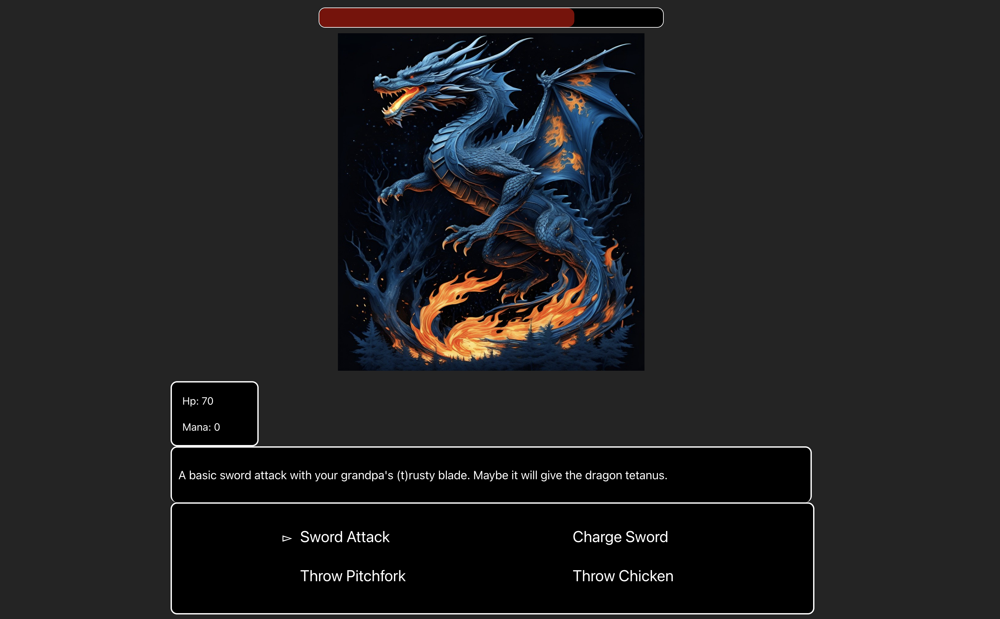

# DRAGONSLAYER

## Live Project
In progress. I will update this section of the README with a link once I have it fully deployed.

## Description
A text-and-turn-based rpg where you are tasked with slaying a dragon! The final version of this game will include two different endings you can unlock based upon your choices, though the current version only features one. 

This was developed with a C# api for the backend and a JavaScript/React frontend.  

## Controls
Arrow keys: Change Selection
Enter and Spacebar: Confirm
Backspace and Shift: Go Back One Menu

## Screenshots

## Credits For Art Used In-Game
Shield with Crossed Swords: Image by https://pixabay.com/users/clker-free-vector-images-3736/?utm_source=link-attribution&utm_medium=referral&utm_campaign=image&utm_content=33979 

Dragon: Image by Artie Blur from Pixabay 

